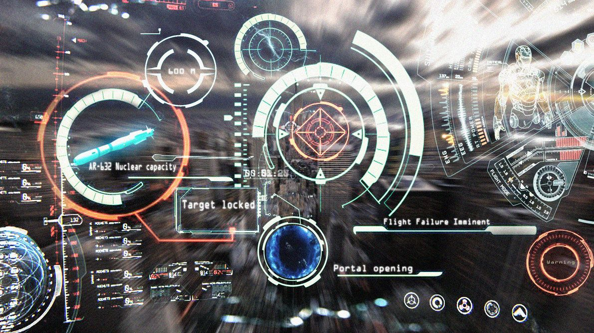

<!-- PROJECT LOGO -->

  
    

    <h2 align="center">OpenCV Exploration</h2>
    

  

<!-- ABOUT THE PROJECT -->
## Raspberry Pi Setup

  - Raspberry Pi 4/4GB 
  - OpenCV 4.5.5
  - Webcam (not a pi camera)    
 
## Resources
[RaspberryPi Imager]("https://www.raspberrypi.com/software/") 
[Install OpenCV]("https://qengineering.eu/install-opencv-4.5-on-raspberry-pi-4.html") 
[Webcam]("https://raspberrypi-guide.github.io/electronics/using-usb-webcams")
[VSCode]("https://code.visualstudio.com/docs/setup/raspberry-pi")

## Notes
  
  - Using advanced options in pi imager (preset host, ssh, wifi) caused a boot loop
  - Reset image to base and configured afterwards
  - OpenCV script from [article](("https://qengineering.eu/install-opencv-4.5-on-raspberry-pi-4.html") works well. Includes qt on install.
  - OpenCV install takes about 1.5 hrs on a pi4
  - Legacy camera mode is being deprecated in raspbian. 
  - Webcam does not work with `raspistill` image capture
    - Webcam test `fswebcam -r 1920x1080 --no-banner /path/to/output/file.jpg`

